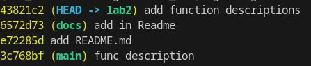

# Geometric lib
Library uses functions providing several geometric formulas.
## Area
- Circle: S = πR²
- Rectangle: S = ab
- Square: S = a²

## Perimeter
- Circle: P = 2πR
- Rectangle: P = 2a + 2b
- Square: P = 4a

## Functions description
### circle.py
- area

   Takes <b>r</b> - radius, returns area
   
   ```python
   print(area(3))
   ```
- perimeter

   Takes <b>r</b>  - radius, returns perimeter of the circle

   ```python
   print(perimiter(3))
   ```
### rectangle.py
- area

  Takes <b>a, b</b>- length of sides of the rect, returns area

  ```python
  print(area(3, 4))
  ```

- perimeter

    Takes <b>a, b</b>- length of sides of the rect, returns perimeter

    ```python
    print(perimter(3, 4))
    ```

### square.py

- area
    
    Takes <b>a</b> - side, returns area
   
   ```python
   print(area(3))
   ```
- perimeter

   Takes <b>a</b>  - side, returns perimeter of the square

   ```python
   print(perimeter(3))
   ```

### triangle.py

- area
    
    Takes <b>a, h</b> - side and height of the triangle, returns area

    ```python
    print(area(2, 4))
    ```

- perimeter

    Takes <b>a, b, c</b> - sides of the triangle, returns perimeter

    ```python 
    print(perimeter(4, 4, 4))
    ```

## Commit history
